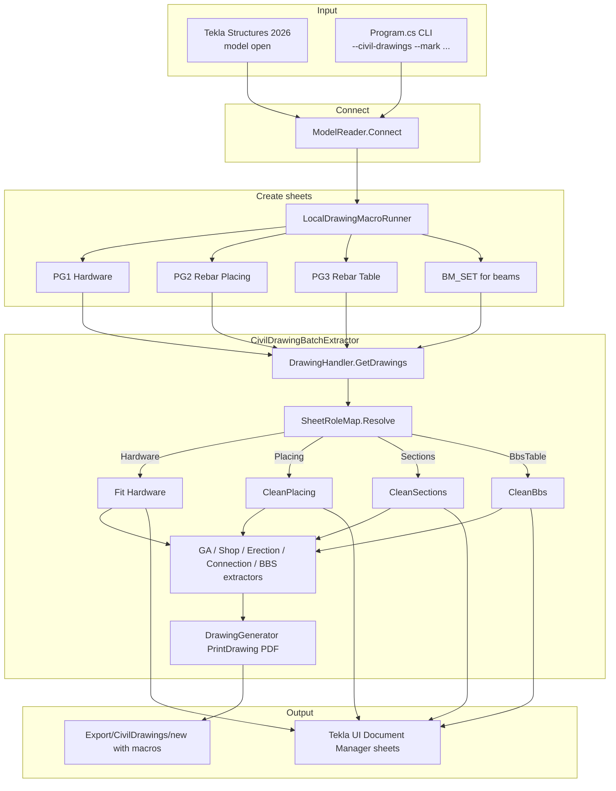
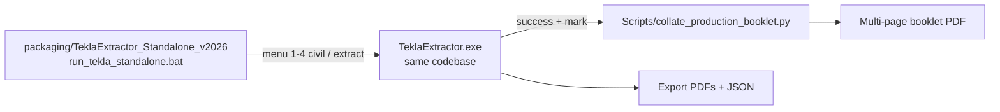

# TeklaExtractor — 2D Civil Drawing Pipeline (Tekla Structures 2026)

Live Open API tool that connects to an open Tekla model, runs Paisley cast-unit macros (PG1 / PG2 / PG3 / BM_SET), fits and cleans each sheet role with a 2-tier dimension algorithm, then extracts JSON / CSV / PDF.

**Stack:** .NET Framework 4.8 · x64 only · Tekla Structures 2026 Open API

---

## Prerequisites

1. **Tekla Structures 2026** running with the target model open.
2. Cast unit selected in the model (for selection-based runs), **or** use `--mark`.
3. Run from a normal **CMD / PowerShell** window — not from a Cursor agent terminal (Tekla remoting can hang there).

```powershell
cd D:\Github\TeklaDrawings2D
dotnet build -c Release -p:Platform=x64
```

Executable after build:

```text
bin\x64\Release\net48\TeklaExtractor.exe
```

If the build fails with a file lock:

```powershell
Get-Process TeklaExtractor -ErrorAction SilentlyContinue | Stop-Process -Force
```

Tekla is read from `C:\Program Files\Tekla Structures\2026.0\bin` unless `Directory.Build.user.props` exists. Copy `Directory.Build.user.props.example` to that name only when the install is somewhere else. The build and run commands above do not change.

Git does not track generated output: `Export/`, `ground_truth.json`, `ground_truth.csv`, `_build_cast/`, and `packaging\TeklaExtractor_Standalone_v2026\bin\`.

---

## Terminal commands

All commands assume Tekla is open. Prefer the Release exe after a successful build.

### Everyday civil runs

```powershell
cd D:\Github\TeklaDrawings2D

# Selection only (safest) — macros → Fit/Clean → PDF/JSON
dotnet run -c Release -p:Platform=x64 -- --civil-drawings

# One piece mark (ignores selection)
dotnet run -c Release -p:Platform=x64 -- --civil-drawings --mark W10-175

# Delete that mark's old sheets, recreate with macros, then Fit/Clean
dotnet run -c Release -p:Platform=x64 -- --civil-drawings --mark W10-175 --clean-mark

# Or call the built exe directly (same flags)
.\bin\x64\Release\net48\TeklaExtractor.exe --civil-drawings --mark W10-175 --clean-mark
```

### Extract-only / Open API / full model

```powershell
# Print existing sheets only (no macros, no create)
.\bin\x64\Release\net48\TeklaExtractor.exe --civil-drawings --extract-only --mark W10-175

# Root PDF folder layout (like older Sep-2 extracts)
.\bin\x64\Release\net48\TeklaExtractor.exe --civil-drawings --extract-only --all --to-root

# Open API CastUnitDrawing.Insert (no RunMacro) → new without macros
.\bin\x64\Release\net48\TeklaExtractor.exe --civil-drawings --skip-macros --mark W10-175

# Whole WALL/COLUMN/BEAM model — long, crash risk; must be explicit
.\bin\x64\Release\net48\TeklaExtractor.exe --civil-drawings --all
```

### Other useful flags

```powershell
.\bin\x64\Release\net48\TeklaExtractor.exe --extract          # ground_truth.json + .csv
.\bin\x64\Release\net48\TeklaExtractor.exe --inventory        # all drawings inventory
.\bin\x64\Release\net48\TeklaExtractor.exe --shop-drawings    # CU shop contours export
.\bin\x64\Release\net48\TeklaExtractor.exe --html-only        # rebuild Export HTML indexes
.\bin\x64\Release\net48\TeklaExtractor.exe --coverage-only    # coverage_report.txt
.\bin\x64\Release\net48\TeklaExtractor.exe --preflight-qa     # with civil: tape/margin checks
```

### Flag cheat sheet

| Flag | Effect |
|------|--------|
| `--civil-drawings` | Main civil pipeline entry |
| `--mark <piece>` | Limit to one piece (e.g. `W10-175`) |
| `--clean-mark` | Delete that mark's sheets before macros (needs `--mark`) |
| `--extract-only` | Skip create; extract existing Document Manager sheets |
| `--skip-macros` | Create via Open API instead of PG1/PG2/PG3 |
| `--all` | Full WALL/COLUMN/BEAM model (crash risk) |
| `--to-root` | Write under `Export/CivilDrawings` root `PDF/` |
| `--enable-mark-repair` | Opt-in mark rewrite (off by default) |
| `--preflight-qa` | Fail run if Fit margins / tape conservation fail |

### What a successful placing run looks like (W10-175 - 2)

```text
[Civil] role=Placing stem=W10-175_-_3
[Placing] native dims elev=… END2=33 VIEW_A=20
[Placing] TOP IN FORM 2-tier …
[Placing] END 2 preserve-native dims=33
[Placing] VIEW A preserve-native dims=20
[Fit] bboxAssert failures=0
[Placing] W10-175-2 macros+2tier: … bboxFailures=0
```

Then reopen **`[W10-175 - 2]`** in Tekla Document Manager.

### Fabrication booklet (auto)

After every successful `--civil-drawings` run (macros, `--clean-mark`, or `--extract-only`), the tool collates that wall’s role PDFs into **one multi-page booklet**:

| Booklet page | Role PDF |
|--------------|----------|
| PAGE - 1 | `{mark}_-_1.pdf` Hardware |
| PAGE - 2 | `{mark}_-_2_Sections_3D.pdf` (or `_-_2`) |
| PAGE - 3 | `{mark}_-_3.pdf` Placing |
| PAGE - 4 | `{mark}_-_4.pdf` BBS |
| PAGE - 5/6 | optional overflow |

Output example:

```text
Export\CivilDrawings\new with macros\PDF\P22-132.W10-175.Rev 2.pdf
```

Requires Python + PyMuPDF (`pip install pymupdf`). Skip with `--no-booklet`.

**Note:** Tekla Document Manager still shows 4–5 separate sheets (Open API / macros create one sheet each). The **booklet** is the combined PDF for print/issue — same as the standalone menu’s collate step.

```powershell
# Same as before — booklet is automatic at the end
.\bin\x64\Release\net48\TeklaExtractor.exe --civil-drawings --mark W10-175 --clean-mark
.\bin\x64\Release\net48\TeklaExtractor.exe --civil-drawings --extract-only --mark W10-175

# Collate only (no Tekla Fit), if PDFs already exist
python Scripts\collate_production_booklet.py --mark W10-175
```


---

## How the codebase works

### High-level idea

```text
3D Tekla model (open)
    → ModelReader connects via Open API remoting
    → LocalDrawingMacroRunner runs PG1 / PG2 / PG3 (or BM_SET)
         creates CU booklet sheets in Document Manager
    → CivilDrawingBatchExtractor walks drawings
         SheetRoleMap classifies each sheet
         PrecastDimensionPostProcessor Fit / Clean*
         extractors write JSON/CSV; DrawingGenerator prints PDF
    → Export\CivilDrawings\...
```

### Sheet roles (4-page booklet)

| Document Manager | Role | Post-process |
|------------------|------|--------------|
| `[W10-175 - 1]` | Hardware | `Fit` — elevation + 7-tier / 2-tier shop dims |
| `[W10-175 - 2]` | Sections (or sibling) | `CleanSections` |
| Placing sheet (often `-2` / name REINFORCING PLACING) | Placing | `CleanPlacing` — keep dense END 2 / VIEW A native dims; 2-tier on TOP IN FORM; pack in sheet bbox |
| BBS / rebar table | BbsTable | `CleanBbs` |

`SheetRoleMap` (`src/Drawings/SheetRole.cs`) is the single map used for Fit dispatch, PDF stems, and booklet collation.

### Key source files

| File | Role |
|------|------|
| `src/Program.cs` | CLI entry, flag parse, interactive menu |
| `src/Model/ModelReader.cs` | Connect to live Tekla with retries |
| `src/Drawings/LocalDrawingMacroRunner.cs` | Copy `src/LocalMacros\` → model; `RunMacro` PG1/PG2/PG3/BM_SET |
| `src/Civil/CivilDrawingBatchExtractor.cs` | Orchestrate create → role → Fit/Clean → extract → PDF |
| `src/Drawings/PrecastDimensionPostProcessor.cs` | `Fit`, `CleanPlacing`, `CleanSections`, `CleanBbs`, bbox assert |
| `src/Drawings/SheetRole.cs` | Mark/name → Hardware / Sections / Placing / BbsTable |
| `src/Civil/*Extractor.cs` | GA / Erection / Shop / Connection / Rebar-BBS JSON |
| `src/Drawings/DrawingGenerator.cs` | `PrintDrawing` → PDF (TS PDF Writer) |
| `src/LocalMacros/SP_M.CU_PG*.cs` | Paisley shop macros (source of dense native dims) |
| `Scripts/collate_production_booklet.py` | Optional multi-page PDF booklet |

### Macros → 2-tier path (placing sheet)

1. **Macros** create views and dense dimension stacks (especially END 2).
2. **`CleanPlacing`** selectively purges only the elevation dims (and left junk), **preserves** native END 2 / VIEW A when dense enough.
3. Relayout: TOP IN FORM on top, END 2 bottom-left, VIEW A to the right of END 2 (no overlap).
4. **2-tier** algorithm places elevation overall / opening / side verticals from live model length.
5. **bboxAssert** checks everything stays inside the sheet / BOM gap.

PDF numbers win over invented values; Fit does not stretch `Layout.SheetSize`.

---

## Architectural workflow chart



### Standalone launcher path



---

## Standalone package role

**Path:** `packaging\TeklaExtractor_Standalone_v2026\`

This is **not a second codebase**. It is a **portable launcher + snapshot** of the built engine for operators who should not open Visual Studio / Cursor.

| Item | Purpose |
|------|---------|
| `run_tekla_standalone.bat` | Menu: W10-175 / W10-78 / custom mark / selection / ground truth / rebuild |
| `bin\TeklaExtractor.exe` + Tekla + PdfPig DLLs | Frozen copy of the Release build |
| `bin\LocalMacros\` | Bundled PG1/PG2/PG3 macros copied into the model on run |

### How it works

1. Bat finds the **repo root** (two levels above the bat) so outputs still land under `Export\…`.
2. Menu options call the same CLI the repo uses, e.g.  
   `TeklaExtractor.exe --civil-drawings --mark W10-175 --clean-mark`.
3. On success it runs `python Scripts\collate_production_booklet.py --mark …` to stitch pages.
4. Option **[6]** rebuilds from source (`dotnet build -c Release`).

**Important:** Day-to-day development builds go to:

```text
bin\x64\Release\net48\TeklaExtractor.exe
```

The bat calls `bin\x64\Release\net48\TeklaExtractor.exe` from the repo root. Prefer that exe while iterating, and refresh `packaging\TeklaExtractor_Standalone_v2026\bin\` after a good Release build when operators use the frozen snapshot.

Use standalone when you want a **double-click / menu** workflow without remembering flags. Use the repo CLI when iterating on `PrecastDimensionPostProcessor` / Fit / CleanPlacing.

---

## Modules (extract types)

| Drawing type | Class | Folder |
|--------------|-------|--------|
| GA | `GaCivilExtractor` | `GA/` |
| Erection | `ErectionCivilExtractor` | `ERECTION/` |
| Shop / production | `ShopProductionExtractor` | `SHOP/` |
| Connection | `ConnectionDetailExtractor` | `CONNECTION/` |
| Rebar / BBS | `RebarBbsExtractor` | `REBAR_BBS/` |

Batch entry: `CivilDrawingBatchExtractor`. Failures go to `extract_errors.log`; the run continues.

Units are **raw millimetres** (mm³ / kg). Grade strings are not converted.

---

## Build matrix

| Setting | Value |
|---------|--------|
| `TargetFramework` | `net48` |
| Platform | **x64** (x86 / AnyCPU will not load Tekla 2026) |
| Tekla DLLs | `C:\Program Files\Tekla Structures\2026.0\bin\` |

---

## Repository layout

```text
TeklaExtractor.csproj          project file (output: bin\x64\Release\net48)
TeklaExtractor.sln
App.config
src/Program.cs                 CLI entry
src/Model/                     connect and 3D extract
src/Drawings/                  create, Fit/Clean, print
src/Civil/                     civil batch, role extractors, HTML, booklet
src/Extract/                   inventory, shop, floor, and QA dumps
src/LocalMacros/               Paisley macros copied into the Tekla model
Scripts/                       booklet collation and sheet helpers
Tools/DrawingViewer/           HTML review template
Tools/probes/                  one-off mark listing probes
packaging/TeklaExtractor_Standalone_v2026/
docs/reference/                long specifications
docs/investigation/            W10-175 QA notes
```

Namespaces stay `TeklaExtractor` and `TeklaExtractor.Services`. Folder names are for layout only.

## Files left at the repo root

These stayed in place. They are experiment scripts, recovered dumps, or generated output, not the product tree.

- Experiment rewriters: `experiment_fix.py`, `experiment_fix2.py`, `experiment_fix3.py`, `experiment_fix_safe.py`, `update_refit.py`, `update_emitdim.py`
- Transcript recovery: `recover_code.py`, `recover_code_full.py`, `check_tools.py`, `recovered.txt`, `recovered_best.txt`
- Generated model extract from `--extract`: `ground_truth.json`, `ground_truth.csv`
- Build cast, not source: `_build_cast/`
- Generated exports: `Export/` (gitignored)

Logs, screenshots, `Services.zip`, and extra copies of the specification PDFs also remain at the root.

## Docs

- [docs/CivilDrawings-PDF-Extraction.md](docs/CivilDrawings-PDF-Extraction.md) — how PDFs were produced and sheet-boundary behavior
- Long specifications under `docs/reference/`
- Investigation notes under `docs/investigation/` for W10-175 QA vs Rev 2

---

## Quick start checklist (W10-175 placing like screenshot 2)

1. Open Paisley model in Tekla 2026.
2. From PowerShell (not Cursor agent terminal):

```powershell
cd D:\Github\TeklaDrawings2D
dotnet build -c Release -p:Platform=x64
.\bin\x64\Release\net48\TeklaExtractor.exe --civil-drawings --mark W10-175 --clean-mark
```

3. Wait for `[Placing] … preserve-native … bboxFailures=0`.
4. In Tekla, open **`[W10-175 - 2]`** (placing) from Document Manager.
5. Confirm END 2 dense dims kept, VIEW A separate, TOP IN FORM 2-tier, content inside blue sheet border.
