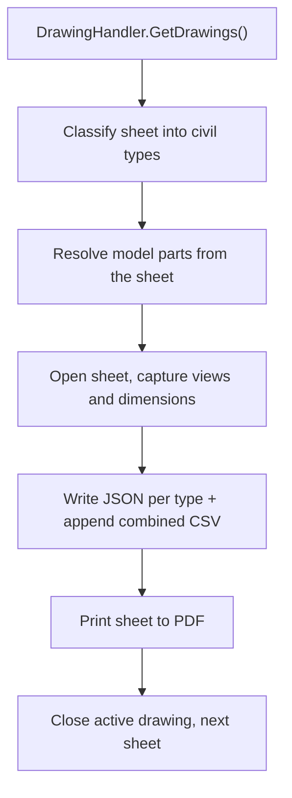

# How the PDFs in `Export\CivilDrawings\PDF` were produced

This document explains two separate questions about the 29 PDFs in `Export\CivilDrawings\PDF`:

1. Which run created them, and what the extraction pipeline actually did.
2. How the drawing ends up **inside the sheet boundary** in the exported PDF.

The short version of point 2: our code does not fit the drawing into the frame. The boundary comes from Tekla's own sheet layout and view placement. Our code only maps that finished sheet onto one PDF page.

---

## 1. Which run created this folder

These files come from a single run on **2 September 2026**, produced by a build that existed **before** the `new with macros` / `new without macros` folder split. At that time the output root was `Export\CivilDrawings` itself.

The coverage report header is the proof:

```1:6:c:\Users\ASUS\Desktop\2d_tekla\Export\CivilDrawings\coverage_report.txt
CIVIL DRAWING COVERAGE REPORT
GeneratedUtc: 2026-09-02T05:09:34.5381050Z
OutputRoot: C:\Users\ASUS\Desktop\2d_tekla\Export\CivilDrawings
```

Two further pieces of evidence:

- `OutputRoot` is the root folder. Today's code always appends a subfolder name, so this line cannot be produced by the current build.
- There is **no `macros.log`** in the root folder. That file is written whenever macros or the Open API create sheets, so this run created nothing. It extracted sheets that already existed in the model.

Run timeline from file timestamps:

- 10:30 - 10:34 GA JSON files
- 10:34:41 - 10:39:25 the 29 PDFs, roughly 7-10 seconds per sheet
- 10:39:34 the combined WALL/COLUMN/BEAM GA dump
- 10:39:40 coverage report and error log

## What the folder contains

- **29 PDFs** covering 14 pieces: `L-4`, `L-5`, `SR-1`, `SR-2`, `P6-1`, `P6-3`, `P6-5`, `P6-19`, `P6-21`, `P6-30`, `W10-34`, `W10-67`, `W10-80`, `W10-124`
- **JSON**: 14 files each in `SHOP\`, `ERECTION\`, `CONNECTION\`, `REBAR_BBS\`; 10 in `GA\`, including the 1.2 MB `1_WALL_COLUMN_BEAM_GA.json`
- **Combined CSVs** at the root: `SHOP.csv`, `BOM.csv`, `ERECTION.csv`, `CONNECTION.csv`, `REBAR_BBS.csv`, `GA.csv`

---

## 2. The extraction pipeline

`CivilDrawingBatchExtractor.ExtractAllDrawings` walks every sheet returned by `DrawingHandler.GetDrawings()` and, per sheet, performs these steps:



### Sheet classification

`CivilDrawingSupport.Classify` decides which of the five civil types a sheet belongs to. It combines the .NET drawing type with keyword matching over the sheet's text blob:

- `GADrawing` becomes GA, `AssemblyDrawing` becomes ERECTION, `CastUnitDrawing` and `SinglePartDrawing` become SHOP
- macro page names route directly: a hardware page yields SHOP plus CONNECTION, a placing or rebar-table page yields REBAR_BBS, a fabrication or PG4 page yields SHOP
- a generic cast unit shop sheet also gets REBAR_BBS and CONNECTION, because it carries BOM hardware and rebar that civil regeneration needs

One sheet can therefore produce several JSON files. That is why 14 pieces produced 14 files in four different type folders.

### PDF naming

The file name is derived from the Tekla drawing mark:

```352:355:c:\Users\ASUS\Desktop\2d_tekla\Services\CivilDrawingBatchExtractor.cs
                        string stem = CivilDrawingSupport.Sanitize(
                            CivilDrawingSupport.FirstNonEmpty(SafeMark(drawing), pieceGuess, "sheet"));
                        string pdfPath = Path.Combine(pdfDir, stem + ".pdf");
                        string dwgPath = Path.Combine(dwgDir, stem + ".dwg");
```

So the mark `[W10-67 - 1]` becomes `W10-67_-_1.pdf`. Where the mark carried no sheet number, the piece mark was used as a fallback and the file became `W10-67.pdf`.

### Print engine

```319:322:c:\Users\ASUS\Desktop\2d_tekla\Services\DrawingGenerator.cs
        public bool ExportToPdf(Drawing drawing, string pdfPath)
        {
            return PrintToFile(drawing, pdfPath, DotPrintOutputType.PDF, "TS PDF Writer");
        }
```

`PrintToFile` calls `UpdateDrawing` first, then `DrawingHandler.PrintDrawing` with `DPMPrinterAttributes`, and falls back to `SetActiveDrawing` plus a retry if the first print attempt produces nothing.

---

## 3. How the drawing lands inside the sheet boundary

This works in two layers.

### Layer 1: the boundary belongs to Tekla

The frame, the title block and the usable area come from the drawing **layout**. For these sheets that is the `SP_M.CU_*_11X17` property files, meaning an 11x17 sheet. Inside that frame each view carries its own origin, scale and clip box.

Our shop extractor makes the placement math explicit. A view is captured as an origin plus a scale:

```1107:1125:c:\Users\ASUS\Desktop\2d_tekla\Services\CastUnitShopDrawingExtractor.cs
            public static ViewXform From(View view, double scale)
            {
                var x = new ViewXform { Origin = view.Origin ?? new Point(), Scale = scale < 0.01 ? 1 : scale };
                try { x.ViewCs = view.DisplayCoordinateSystem ?? view.ViewCoordinateSystem; }
```

and a model point is converted to a sheet point like this:

```1140:1149:c:\Users\ASUS\Desktop\2d_tekla\Services\CastUnitShopDrawingExtractor.cs
            public double[] ModelToSheet(Point model)
            {
                var p = ModelToView(model);
                return new[]
                {
                    R(Origin.X + p.X / Scale),
                    R(Origin.Y + p.Y / Scale),
                    0
                };
            }
```

A model point is first rotated into the view coordinate system, then divided by the scale and offset by the view origin. That division is the reason a 9366 mm panel occupies only a couple of hundred millimetres on an 11x17 sheet. Tekla applied exactly this placement when the sheets were authored; the code above is how we reproduce and record it.

Note on scope: `ViewXform` lives in the cast unit shop extractor. The civil batch run that produced this folder did not re-project geometry itself. It read the placement Tekla had already committed.

### Layer 2: fitting the finished sheet onto one PDF page

At print time the whole sheet frame is sent as a single page and the scaling decision is left to Tekla:

```425:436:c:\Users\ASUS\Desktop\2d_tekla\Services\DrawingGenerator.cs
                var attrs = new DPMPrinterAttributes
                {
                    OutputType = outputType,
                    PaperSize = DotPrintPaperSize.Auto,
                    ScalingMethod = DotPrintScalingType.Auto,
                    Orientation = DotPrintOrientationType.Landscape,
                    ColorMode = DotPrintColor.Color,
                    OutputFileName = path,
                    OpenFileWhenFinished = false,
                    NumberOfCopies = 1,
                    PrintToMultipleSheet = DotPrintToMultipleSheet.Off,
                    PrinterName = printerName,
                };
```

Three settings do the "inside the boundary" work:

- `PaperSize = Auto` picks the paper from the drawing's own sheet size instead of forcing A4
- `ScalingMethod = Auto` fits the sheet to the page, so the frame is never clipped
- `PrintToMultipleSheet = Off` stops one sheet from being tiled across several partial pages

`UpdateDrawing` runs before this. Without it Tekla refuses to set the sheet active and the print fails.

### How the boundary is recorded in JSON

On the data side the sheet is opened, its views are enumerated and each view's scale is stored:

```1202:1222:c:\Users\ASUS\Desktop\2d_tekla\Services\CivilDrawingSupport.cs
                DrawingObjectEnumerator views = null;
                try { views = sheet.GetAllViews(); }
                catch
                {
                    try { views = sheet.GetViews(); } catch { }
                }
                // ...
                    try { rec.Scale = view.Attributes.Scale; } catch { }
```

Sheet size is read from `drawing.Layout?.SheetSize` with `container.Width` and `container.Height` as fallback, and each view's clip box comes from `view.RestrictionBox`. Those values are the machine-readable form of the boundary and reach the JSON as `RestrictionBoxMin` and `RestrictionBoxMax`.

---

## 4. What did not run

`DrawingPostProcessor` contains the boundary cleanup logic: shifting overlapping labels apart with a 4 mm gap over up to six passes, and hiding objects that fall outside a view's restriction box.

```339:346:c:\Users\ASUS\Desktop\2d_tekla\Services\DrawingPostProcessor.cs
                    bool outside = false;
                    if (obj is TSDrawing.Line line)
                    {
                        outside = !clip.IsInside(line.StartPoint) && !clip.IsInside(line.EndPoint);
                        double dz = Math.Abs(line.StartPoint.Z - line.EndPoint.Z);
                        if (dz > 5.0 && view.ViewType != View.ViewTypes._3DView)
                            outside = true;
                    }
```

None of this touched these PDFs. `CivilDrawingBatchExtractor` creates a bare `DrawingGenerator` and calls `ExportToPdf` without passing a post-processor. The cleanup only runs on `--correct` / `--fix`, or on `--drawings`, which passes the post-processor into `GenerateAndExport`.

---

## 5. Why this matters for the without-macros work

The PDFs in this folder are 100-185 KB because the **views, scales and placement were already authored by macros**. Our code only printed them. The coverage report reflects that richness, for example `W10-67 bom=13 rebar=50 dims=502 views=11`.

There is one telling exception. `W10-67.pdf` is 16,517 bytes, essentially identical to the 16,532 bytes of the Open API sheets produced today. It was a blank or near-empty sheet.

That gives a reliable rule of thumb for this model:

- around 16 KB means a template-only sheet, frame and title block with no populated views
- 100 KB and above means a real, fully detailed drawing

The conclusion is that the print and boundary logic is identical in both cases. `CastUnitDrawing.Insert` does create the sheet and its frame, but it does not populate the views. The difference between the with-macros and without-macros output is not the export path, it is **who authored the content inside the sheet**.
